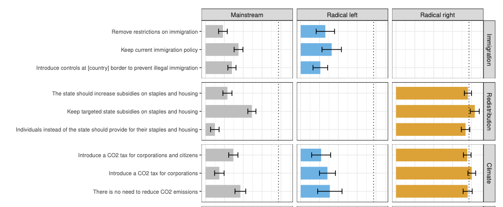
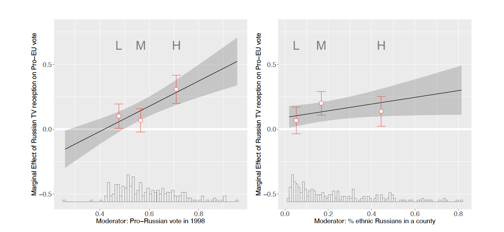
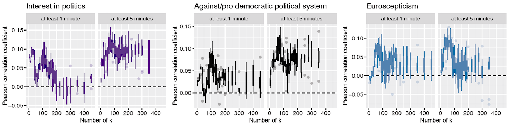
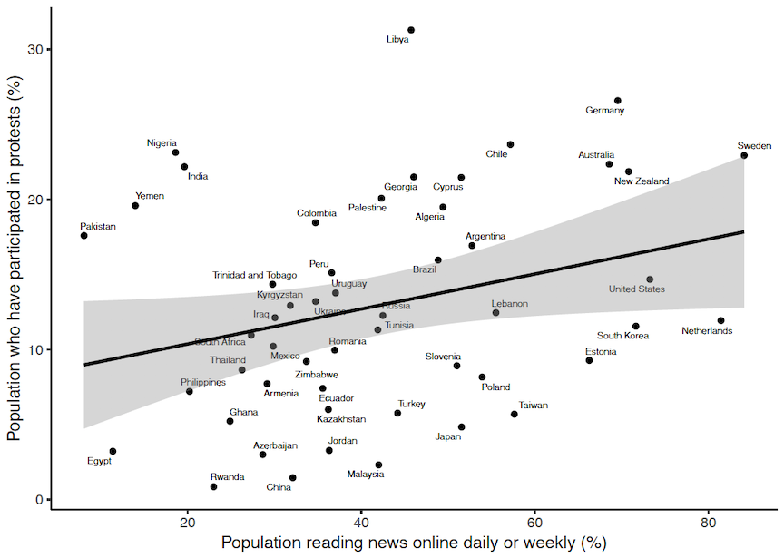

# Research
---
## Survey experiments

### Issue trade-offs and the politics of representation: Experimental evidence from four European democracies
(2022) jointly with Caterina Froio and Sebastian Stier, <i>Accepted in the European Journal of Political Research</i>

To investigate the strength of issue preferences among radical left, radical right and mainstream party voters and the willingness to compromise on their most important issues, we conducted a conjoint survey experiment with 2,000 participants in France, Germany, Italy and Spain. The voting scenario in the experiment featured proposals on salient political issues and different (non)populist stances on political representation. The findings of this study have implications for the electoral prospects of mainstream and radical parties when trying to reposition themselves in the diversifying issue space of contemporary democracies. As such, understanding how voters navigate issue cross-pressures helps to explain the broader dynamics that are (re)configuring political conflict and voting behavior in Europe.

---

## Media and Political Behavior

### Populist Attitudes and Selective Exposure to Online News: A Cross-Country Analysis Combining Web Tracking and Surveys
(2020) jointly with Sebastian Stier, Caterina Froio, Ralf Schroeder, <i>International Journal of Press/Politics</i>, 25(3), 426-446.

Research has shown that citizens with populist attitudes evaluate the news media more negatively, and there is also suggestive evidence that they rely less on established news sources like the legacy press. However, due to data limitations, there is still no solid evidence whether populist citizens have skewed news diets in the contemporary high-choice digital media environment. In this paper, we rely on the selective exposure framework and investigate the relationship between populist attitudes and the consumption of various types of online news. To test our theoretical assumptions, we link 150 million website visits by 7,729 Internet users in France, Germany, Italy, Spain, the United Kingdom, and the United States to their responses in an online survey.

---

### Effects of Biased Media on Foreign Policy Preferences: Evidence from a Natural Experiment
(Working paper)

 
 

The expansion of globalization has made a country's prosperity increasingly dependant on foreign politics. This article shows how Russian television's inflammatory coverage of European politics affected the vote during the European Union membership referendum in Latvia. For identification, I use plausibly exogenous variation of the signal from Russian analog TV towers that was available during the referendum to Latvian counties located close to the Russian border. The analysis of the electoral data showed that in counties with the Russian television reception, votes ``for" outperformed votes ``against" joining the European Union compared to counties without the reception.

---
## Democracy and Technology

### Can Web Browsing Histories Predict Users' Attitudes Towards Immigrants, Climate Change, and Democracy?
(Workimg paper) jointly with Roberto Ulloa, Sebastian Stier, and J&uuml;rgen Pfeffer.

Browsing behavior and visits to website such as donation platforms, social media, streaming service providers, and even online gambling can reflect individuals' life-style, while, as research shows, life-style itself is a predictor of individuals' political issue preferences and attitudes. In this paper, we linked 19,000,000 website visits generated from web tracking of 1,000 users in Germany to self-reported political attitudes to investigate whether website choices can predict individuals’ political orientations.

---
### Online News and Protest Participation in a Political Context: Evidence from Self-Reported Cross-Sectional Data
(2021) jointly with Olessia Koltsova, <i>Social Media + Society</i>, 7(1): <a href="https://doi.org/10.1177/2056305120984456">DOI</a>

 

The availability of alternative information via online news sources is often said to induce social discontent, especially in states, where traditional media are under state control. But does this relation really exist, and is it universal? In contrast to previous studies, where generalized Internet use is treated as a proxy for online news consumption and general political participation is a proxy for protest participation, we render a test of relationship specifically between online news and protest participation. We explore survey data from WVS for 48 nations in 2010-2014.

---
